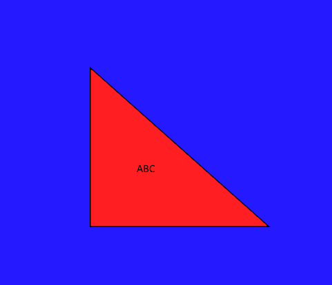
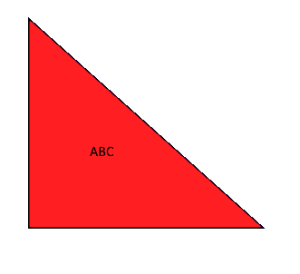

## Zadanie 7. - nakładanie tekstur

### Treść zadania
1) Utworzyć kostkę, na której ściany nałożone są różne tekstury (np. w Paint, sześć ponumerowanych kwadratów, UWAGA 24 bit per pixel, patrz wykład !). Ustawienie wektorów normalnych.

2) Nałożenie tekstury na trójkąt (tak aby obrazek zawierał w sobie trójkąt, należy przeliczyć współrzędne).

W tym zadaniu chodzi o to aby tekstura wyglądała np. tak
 

ale efekt nałożenia na trójkąt był następujący

tzn. nie było niebieskiego (tła), była obwódka, tekst nie był obrócony (chodzi o to aby Państwo dobrze ułożyli wierzchołki)

### Opis rozwiązania
